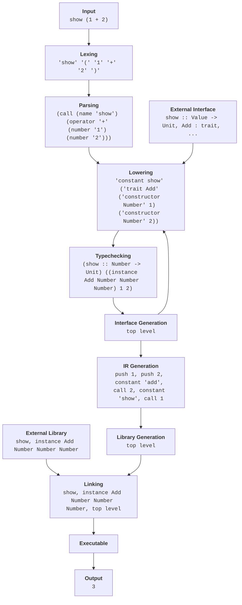

# Project overview

When you write Wipple code, you're essentially typing text into a text field. But computers don't work with text, they operate using instructions on memory. That means the text you type needs to be transformed into a format the computer can work with more directly. The program responsible for these performing these transformations is called the **Wipple compiler**.

The Wipple compiler and related programs, including the interpreter that runs the compiled code and the functionality for displaying error messages, operate in several stages and are split across many folders in the [Wipple repository](https://github.com/wipplelang/wipple). The majority of the project is written in the [Rust programming language](https://www.rust-lang.org); if you aren't familiar with Rust, please visit [Learn Rust](https://www.rust-lang.org/learn).

> It's interesting and maybe slightly confusing that the Wipple programming language is itself written in a different programming language. The Wipple compiler is essentially a program that takes text as input and tries to convert that text into computer instructions according to Wipple's rules. This program is _not_ Wipple itself!
>
> Think of it like writing the user interface for a mobile app: the interface doesn't know what order the user will navigate through the app, but the app must be able to handle all possible valid ways of interacting with the app, and disallow invalid interactions so that the app doesn't end up in an incorrect state. The Wipple compiler has a similar goal — it must accept all "valid" programs and reject all "invalid" programs. The _Rust_ code is what determines what _Wipple_ code is valid.

Here's an overview of how your code goes from text to a runnable program.

1.  **Input:** Wipple reads your code and stores it in a string.
2.  **[Lexing (tokenization)](./lexing.md):** The string is split into a list of tokens, where each token represents a single piece of syntax, like a name, number, or symbol.
3.  **[Parsing](./parsing.md):** Wipple converts this list of tokens into a structured tree that it can traverse.
    -   **[Concrete syntax tree (CST) construction](./parsing.md#cst-construction):** The tokens are split and grouped by punctuation and newlines.
    -   **[Abstract syntax tree (AST) construction](./parsing.md#ast-construction):** "Concrete" syntax is transformed into "abstract" Wipple constructs based on context.
        -   For example, the `A -> B` represents a function type in `x :: A -> B`, but it represents a function expression in `x : A -> B`. Similarly, `_` is a valid type or pattern, but not a valid expression.
4.  **[Lowering](./lowering.md):** The structure of the program defines scope, and definitions are brought into scope and names resolved according to their position within the tree. At this point, names are represented using unique identifiers rather than strings.
5.  **[Typechecking](./typechecking.md):** Wipple assigns every a type to every expression in the program and resolves instances for traits.
6.  **[Interface generation](./driver.md#interface-generation):** The type information from all top-level items in the program is stored in an interface file that can be referenced by other files during lowering.
7.  **[Intermediate representation (IR) generation](./ir-generation.md):** The tree of expressions is converted into a list of instructions that operate on a stack of memory.
8.  **[Library generation](./driver.md#library-generation):** The IR for each item in the program is stored in a library file.
9.  **[Linking](./driver.md#linking):** Multiple library files are combined into a single executable.

From there, the executable can be run using the IR interpreter.
