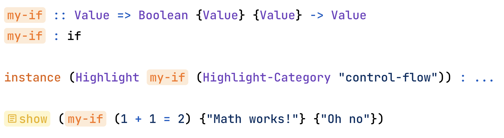
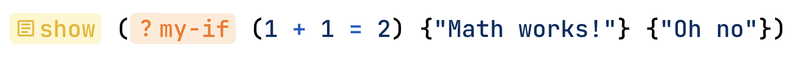

# Interactive elements in the playground

If you use square brackets instead of parentheses, the Wipple Playground will render your code as an interactive element. The supported elements include:

| Element  | Example                                 | Screenshot                                                            |
| -------- | --------------------------------------- | --------------------------------------------------------------------- |
| Color    | `color [Color "#3b82f6"]`               |        |
| Dropdown | `show [Dropdown ("A" , "B" , "C") "A"]` |  |

You can also change how a declaration is highlighted using the `Highlight` trait and its related types `Highlight-Category` and `Highlight-Icon`. For example:

```wipple
my-if :: Value => Boolean {Value} {Value} -> Value
my-if : if

instance (Highlight my-if (Highlight-Category "control-flow"))
```

Would be rendered as:



You can add an icon, too — the Wipple Playground uses Google's [Material Symbols](https://fonts.google.com/icons), so you have access to over 3000 different icons!

```wipple
instance (Highlight my-if (Highlight-Category "control-flow" ; Highlight-Icon "question-mark"))
```



Wipple has several highlight categories, including `control-flow`, `io`, and library-specific categories like `turtle-motion`. The full list of categories is at the bottom of [`theme.ts`](https://github.com/wipplelang/wipple/blob/main/web/playground/src/pages/edit/codemirror/theme.ts).
